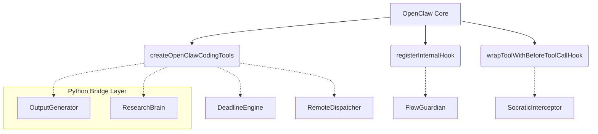

# Cyber-Scholar Agent（赛博学术管家）架构设计文档

> 基于 **OpenClaw TypeScript 框架**扩展，复用率 ≥80% 核心代码。
> 本文档由 Cyber-Scholar Agent 架构师自动生成。

---

## 目录

1. [整体架构概览](#1-整体架构概览)
2. [场景一：DDL 驱动引擎 — DeadlineEngine](#2-场景一ddl-驱动引擎--deadlineengine)
3. [场景二：跨端算力调度中枢 — RemoteDispatcher](#3-场景二跨端算力调度中枢--remotedispatcher)
4. [场景三：上下文感知健康守护者 — FlowGuardian](#4-场景三上下文感知健康守护者--flowguardian)
5. [场景四：自动化报告流水线 — OutputGenerator](#5-场景四自动化报告流水线--outputgenerator)
6. [场景五：多模态文献大脑 — ResearchBrain](#6-场景五多模态文献大脑--researchbrain)
7. [场景六：苏格拉底式拦截器 — SocraticInterceptor](#7-场景六苏格拉底式拦截器--socraticinterceptor)
8. [工具注册策略总览](#8-工具注册策略总览)
9. [最具挑战性技术点深析](#9-最具挑战性技术点深析)

---

## 1. 整体架构概览

### 1.1 设计哲学

Cyber-Scholar Agent 遵循 **"扩展而非重写"** 的核心约束：

- 不触碰 OpenClaw 的核心调度逻辑（`pi-embedded-runner`、`acp-spawn`、`subagent-registry`）
- 所有新功能通过三条官方扩展通道接入：
  1. **工具注册**：在 `createOpenClawCodingTools()` 末尾注入新 `AnyAgentTool`
  2. **钩子系统**：通过 `registerInternalHook()` 订阅生命周期事件
  3. **前置拦截器**：通过 `wrapToolWithBeforeToolCallHook()` 在工具执行前注入逻辑

### 1.2 模块关系图



### 1.3 目录结构规划

在 OpenClaw 工作目录下新建 `extensions/cyber-scholar/` 目录：

```text
extensions/cyber-scholar/
├── index.ts                  # 统一注册入口
├── deadline-engine/
│   ├── types.ts              # DeadlineTask, ComplexityScore 接口
│   ├── complexity-scorer.ts  # 任务复杂度评估算法
│   └── deadline-cron.ts      # 挂载到 CronService
├── remote-dispatcher/
│   ├── types.ts              # SSHConfig 接口
│   ├── ssh-bridge.ts         # child_process SSH 桥接
│   └── tmux-monitor.ts       # tmux 进程监控
├── flow-guardian/
│   ├── types.ts              # ActivityState 接口
│   ├── system-monitor.ts     # CPU/IO 状态轮询
│   └── welcome-back.ts       # 复工摘要生成器
├── output-generator/
│   ├── types.ts              # ReportRequest 接口
│   ├── python-bridge.ts      # Python脚本生成与执行
│   └── typst-compiler.ts     # Typst 编译工具
├── research-brain/
│   ├── types.ts              # PaperMeta 接口
│   ├── mineru-bridge.ts      # MinerU 解析桥接
│   └── citation-tracker.ts   # 跨论文指标追踪
└── socratic-interceptor/
    ├── types.ts              # InterceptRule 接口
    └── interceptor.ts        # before_tool_call 拦截逻辑
```
## 2. 场景一：DDL 驱动引擎 — DeadlineEngine

### 2.1 需求分析
针对复杂学术/科研任务（带有隐藏配置时间、模型训练时间等），倒推时间线并注册提醒，避免“临门一脚”的惨剧。

### 2.2 扩展点选择
**OpenClaw `cron` 系统** (`src/cron/service.ts`)。利用其 `CronService` 的定时能力。

### 2.3 核心设计
实现一个任务解析工具（`DeadlineTool`），允许写入复杂任务。Agent 解析大纲后，使用内部算法评估 `ComplexityScore`，计算出“真实”所需时间，并注册多个渐进式 Cron 任务。

### 2.4 TypeScript 接口草图

```typescript
// extensions/cyber-scholar/deadline-engine/types.ts

export interface ComplexityScore {
  computeTimeDays: number;     // 评估的算力消耗时间（如跑模型）
  configTimeDays: number;      // 环境依赖配置时间
  writingTimeDays: number;     // 纯文本写作时间
  totalEstimatedDays: number;
}

export interface DeadlineTask {
  id: string;
  title: string;
  outline: string;             // 用户输入的原始大纲
  formalDeadline: Date;        // 官方 DDL
  complexity: ComplexityScore; // AI 预估复杂度
  cronJobIds: string[];        // 注册到 OpenClaw 的提醒任务 ID
}

export interface IDeadlineEngine {
  /** 解析大纲，评估任务耗时 */
  estimateComplexity(outline: string, resources: string[]): Promise<ComplexityScore>;
  /** 基于复杂度，倒推并向 OpenClaw 注册渐进式提醒（Cron） */
  scheduleReminders(task: DeadlineTask): Promise<void>;
}
```
## 3. 场景二：跨端算力调度中枢 — RemoteDispatcher

### 3.1 需求分析
自动接管代码静默同步（如将轻量级 WSL2 本地代码同步到重型 GPU 服务器，并排除权重），并接管后台 tmux 会话。

### 3.2 扩展点选择
**OpenClaw 工具注册系统**。利用现成的 `createExecTool` (`src/agents/bash-tools.exec.ts`) 作为基础，封装更高阶的同步逻辑。

### 3.3 核心设计
实现 `RemotePushTool` 和 `RemoteTmuxTool`，分别通过 Node.js 的 `child_process.exec` 调用 `rsync`（本地排除 `.bin`、`.pt`）与远程执行 ssh 初始化脚本，并返回结果流给 Agent。

### 3.4 TypeScript 接口草图

```typescript
// extensions/cyber-scholar/remote-dispatcher/types.ts

export interface SSHConfig {
  host: string;
  user: string;
  port: number;
  privateKeyPath?: string;
}

export interface SyncOptions {
  localSource: string;
  remoteTarget: string;
  excludePatterns: string[];   // 如 ["*.bin", "*.pt", ".git/"]
  dryRun?: boolean;
}

export interface IRemoteDispatcher {
  /** 后台静默执行代码同步 */
  syncCode(config: SSHConfig, options: SyncOptions): Promise<void>;
  /** 检测或拉起远程 tmux session，接管进程 */
  attachTmux(config: SSHConfig, sessionName: string): Promise<string>; // 返回日志输出
}
```
## 4. 场景三：上下文感知健康守护者 — FlowGuardian

### 4.1 需求分析
心流保护与物理健康预警。在 CPU/网络高负载（如模型编译/下载）时保持静默；在用户长时间停止输入时，触发系统原生弹窗提醒休息，并在用户返回时打印“复工摘要”。

### 4.2 扩展点选择
**系统 Hook 与 OpenClaw 事件钩子系统**。使用 `src/hooks/internal-hooks.ts` 订阅消息和代理活动，同时结合 Node.js 原生的 `os` 模块和可能的本地原生接口。

### 4.3 核心设计
这是一个长期驻留的 Daemon。通过 `system-monitor.ts` 轮询本地 CPU/网络 I/O。当负荷下降且检测到空闲时间达标时，发送系统级 Notification。当恢复键盘输入后，触发代理内部状态检索，打印“Welcome Back”摘要。

### 4.4 TypeScript 接口草图

```typescript
// extensions/cyber-scholar/flow-guardian/types.ts

export type ActivityState = "immersion" | "idle" | "away";

export interface HealthEvent {
  timestamp: Date;
  state: ActivityState;
  cpuLoad: number;             // 当前系统 CPU 负载百分比
  networkThroughput: number;   // 当前网络 I/O
}

export interface IFlowGuardian {
  /** 启动系统级硬件监控（轮询） */
  startMonitoring(intervalMs: number): void;
  /** 触发久坐/用眼休息弹窗 */
  triggerRestReminder(reason: string): Promise<void>;
  /** 生成从离开到现在的任务进展摘要 */
  generateWelcomeBackSummary(sessionKey: string): Promise<string>;
}
```
## 5. 场景四：自动化报告与投影片流水线 — OutputGenerator

### 5.1 需求分析
自动将脏数据（CSV/JSON）清洗、画图，并编译成排版精美的 PDF 报告。摒弃 LaTeX 的脆弱环境，转投 Typst 的怀抱。

### 5.2 扩展点选择
**OpenClaw 工具注册系统**。开发 `ReportGeneratorTool` 并在 `createOpenClawCodingTools` 注入。底层通过 `child_process` 桥接到 Python（Matplotlib/Pandas）和 Typst 编译器。

### 5.3 核心设计
Agent 先调用执行 Python 脚本清洗数据并生成图表（保存到 `sandbox` 或特定临时目录），然后生成 `.typ` 源码，最后调用 Typst 的 CLI 或其 Node.js wrapper 生成最终 PDF，并返回文件在系统中的绝对路径供下载和呈现。

### 5.4 TypeScript 接口草图

```typescript
// extensions/cyber-scholar/output-generator/types.ts

export interface ChartSpec {
  dataSourcePath: string;      // 原始 CSV/JSON 路径
  chartType: "line" | "bar" | "scatter";
  xAxisKey: string;
  yAxisKeys: string[];
  title: string;
  outputImagePath: string;     // 生成图像的位置
}

export interface ReportRequest {
  title: string;
  author: string;
  abstract: string;
  sections: { title: string; content: string }[];
  charts: ChartSpec[];
  outputPdfPath: string;
}

export interface IOutputGenerator {
  /** 根据 specification 组装并运行 Python 绘图脚本 */
  generateCharts(charts: ChartSpec[]): Promise<void>;
  /** 组装 Typst 源码并直接编译输出 PDF */
  compileTypstReport(request: ReportRequest): Promise<string>;
}
```
## 6. 场景五：多模态文献大脑 — ResearchBrain

### 6.1 需求分析
解决由于长篇 PDF 版面解析错误带来的 RAG 幻觉，并支持跨论文追踪某个指标（如 AUC ROC 基线）。

### 6.2 扩展点选择
**OpenClaw 工具注册系统**。开发 `ResearchBrainTool` 并在 `createOpenClawCodingTools` 注入调用权限。其后台通过 Node.js 的 `child_process` 对接 MinerU (高精度版面分析) 和 本地 ChromaDB 向量数据库。

### 6.3 核心设计
Agent 接收用户 PDF 或 arXiv 链接后，调用该工具。工具内部触发 Python 进程调用 MinerU 提取 `text.md` 和 `images/`，并将带有版面结构 metadata 的内容存入向量库。后续检索不仅包含 chunk 文本，还附带其所在图表上下文的精确 metadata。

### 6.4 TypeScript 接口草图

```typescript
// extensions/cyber-scholar/research-brain/types.ts

export interface PaperMeta {
  arxivId?: string;
  localPath?: string;
  extractionVersion: string; // e.g. "MinerU-v1.2"
}

export interface RAGQuery {
  concept: string;           // 如 "AUC ROC baseline models"
  filterArxivIds?: string[]; // 指定文献范围
  crossReference: boolean;   // 是否强制跨文献对比
}

export interface IResearchBrain {
  /** 调度 MinerU 解析复杂版面 PDF，并入库 */
  ingestPaper(meta: PaperMeta): Promise<boolean>;
  /** 跨文献语义检索，返回附带溯源链接的结构化结果 */
  queryConcept(query: RAGQuery): Promise<{ source: string, excerpt: string }[]>;
}
```
## 7. 场景六：苏格拉底式拦截器 — SocraticInterceptor

### 7.1 需求分析
作为逻辑陪练与启发式导师，在死磕复杂逻辑时，强行拦截 Agent 直接输出完整代码的权限。转而提供刁钻测试用例或启示（Edge Cases）来触发用户程序的崩溃。

### 7.2 扩展点选择
**OpenClaw 工具拦截器系统**。利用现成的 `wrapToolWithBeforeToolCallHook()` (`src/agents/pi-tools.before-tool-call.ts`)，在执行如 `edit` 或 `write` 工具前，插入 `SocraticInterceptor` 的逻辑。

### 7.3 核心设计
Agent 被赋予一种可以主动切换的模式：`SocraticMode`。在开启后，所有能产生具体代码变更的工具请求都会触发 `before_tool_call`。拦截器截获原始修改，替换成带有边界测试用例或分析报告的代码抛入用户的代码库，并拒绝原始工具调用。

### 7.4 TypeScript 接口草图

```typescript
// extensions/cyber-scholar/socratic-interceptor/types.ts

export type InterceptionAction = "block" | "modify" | "pass";

export interface SocraticMode {
  enabled: boolean;
  targetTopics: string[];      // 只针对数组、图论等特定话题
}

export interface InterceptRule {
  toolName: string;
  action: InterceptionAction;
  generateHint: (originalCode: string) => Promise<string>; // LLM 子调用生成提示
}

export interface ISocraticInterceptor {
  /** 注册所有的拦截规则规则 */
  registerRules(manager: any): void;
  /** 执行 before_tool_call 钩子的核心拦截逻辑 */
  handleBeforeToolCall(toolName: string, params: object): Promise<{ blocked: boolean, reason?: string }>;
}
```
## 8. 工具注册策略总览

在 `src/agents/pi-tools.ts` 的 `createOpenClawCodingTools` 中，统一挂载我们的新工具：

```typescript
// extensions/cyber-scholar/index.ts

import { generateDeadlineTool } from './deadline-engine/deadline-cron';
import { generateRemoteTmuxTool, generateRemotePushTool } from './remote-dispatcher/ssh-bridge';
import { generateReportTool } from './output-generator/python-bridge';
import { generateResearchBrainTool } from './research-brain/mineru-bridge';
import { wrapWithSocraticInterceptor } from './socratic-interceptor/interceptor';

export function getCyberScholarTools(options: any): AnyAgentTool[] {
  const customTools = [
    generateDeadlineTool(options),
    generateRemoteTmuxTool(options),
    generateRemotePushTool(options),
    generateReportTool(options),
    generateResearchBrainTool(options),
  ];

  // 如果处于苏格拉底模式，包装原有及部分 custom tools
  return customTools.map(tool => wrapWithSocraticInterceptor(tool, options));
}
```

在核心的 `createOpenClawCodingTools` 函数（`src/agents/pi-tools.ts`第 458 行附近）注入：

```typescript
    ...getCyberScholarTools(options), // 挂载赛博管家工具集
    // Channel docking: include channel-defined agent tools (login, etc.).
    ...listChannelAgentTools({ cfg: options?.config }),
```

---

## 9. 最具挑战性技术点深析

### 跨进程调度的不确定性与进程幽灵 (Process Zombie/Orphan)

**技术难点：**
场景四（OutputGenerator）和场景五（ResearchBrain）均需要通过 Node.js 的 `child_process.exec/spawn` 桥接 Python 环境执行繁重任务（如 MinerU OCR 提图，Matplotlib 渲染大量数据点）。
如果 OpenClaw Agent 进程在等待这些子进程回调的过程中崩溃、重启或被强行 Kill，这些失控的 Python/Typst 子进程将变成“幽灵进程”占用大量系统内存和显存。

**架构层面的解决方案：**
1. **脱离主线程生命周期的托管执行设计**：不在 `api-tools.ts` 中以同步 `await` 的方式痴等 `child_process` 的结果。
2. 转而使用类似 **Task Spooler (TS)** 或 **tmux 守护进程**机制。TypeScript 工具端只需下发 "Task ID" 和启动命令。
3. Agent 主动订阅 `internal-hooks` 或 `system-monitor`。
4. 开发健壮的 `pid` 回收机制：在 `child_process` 启动时，记录 `pid` 到本地 `.pid` 注册表，每次 OpenClaw 网关/代理 `bootstrap` 启动时（借助 `AgentBootstrapHookEvent`），触发全局扫描并清理历史僵尸进程。

---
> 架构设计结束

