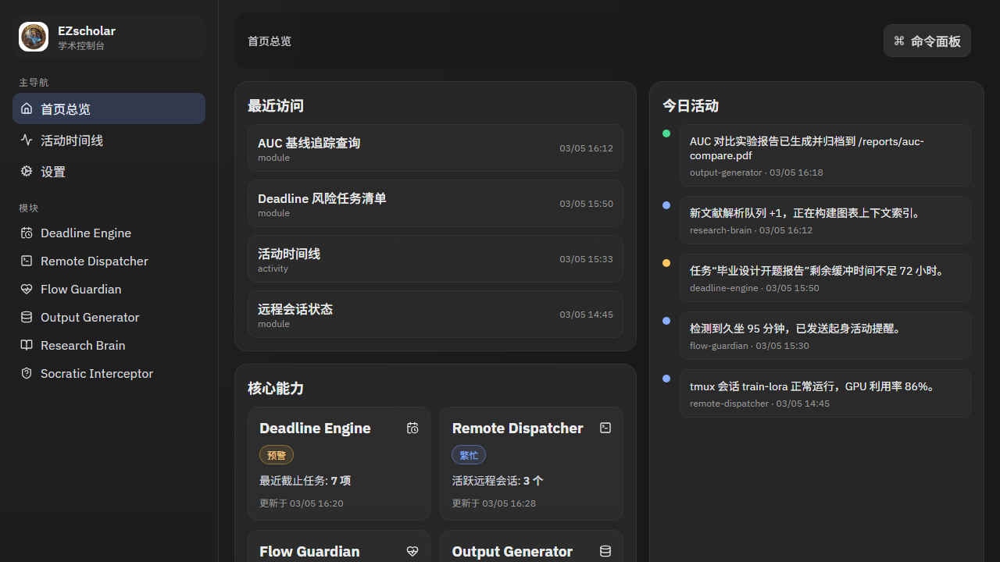
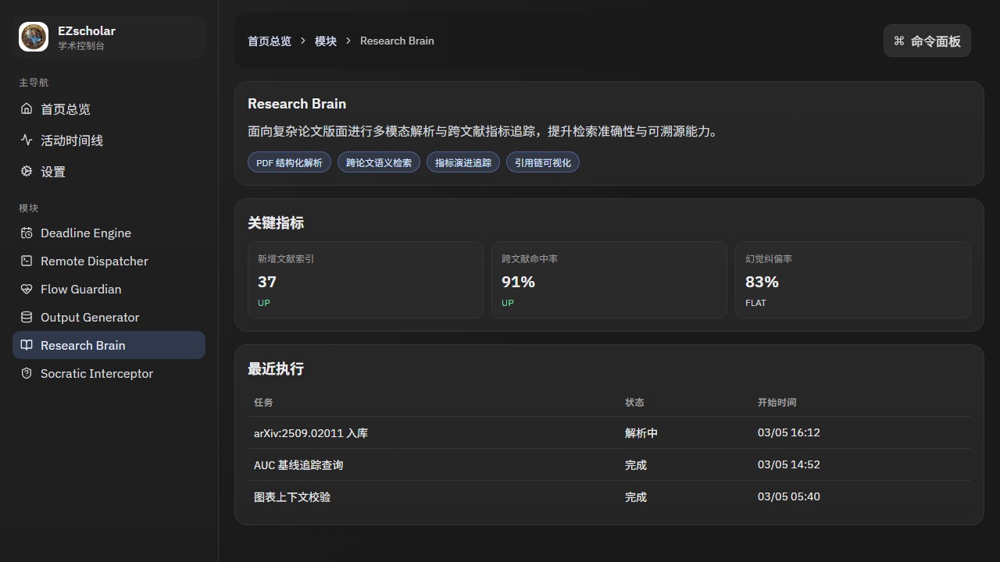

<div align="center">

# EZscholar


一个面向高校与科研场景的本地化「EZscholar 学术助手」，帮助你把“任务管理、远程算力、健康节律、报告产出、文献检索、启发式学习”整合到一个控制台里。


</div>

---

## 为什么做这个项目（痛点）

传统工具把科研流程切得很碎：

- 截止日期只会“到点提醒”，不会考虑任务真实复杂度（训练时间、环境配置、数据准备）。
- 本地与远程 GPU 之间切换频繁，代码同步和会话管理成本高。
- 专注时怕被打断，休息后又容易断上下文。
- 数据清洗、画图、排版和报告导出流程长、易出错。
- 长论文检索容易丢失图表上下文，跨论文指标追踪困难。
- 学习算法时直接给答案，削弱思考过程。

EZscholar 的目标是把这些高频痛点收束成一个统一工作流。

---

## 当前功能

目前仓库已落地前端控制台（Notion 风格桌面端），并提供 mock-first 数据流：

- `Deadline Engine`：DDL 倒推与风险预警视图
- `Remote Dispatcher`：跨端同步与会话监控视图
- `Flow Guardian`：专注/休息状态与事件回放
- `Output Generator`：报告流水线指标与执行历史
- `Research Brain`：文献解析与检索追踪面板
- `Socratic Interceptor`：启发式拦截模式状态
- 全局命令面板：`Ctrl/Cmd + K`（导航 + 模拟动作）
- 活动时间线：统一事件流展示

---

## 界面预览

### 首页总览



### 模块详情（Research Brain）



---

## 快速开始

### 1. 安装依赖

```bash
cd frontend
npm install
```

### 2. 本地启动

```bash
npm run dev
```

默认访问地址（以终端输出为准）：

- `http://127.0.0.1:5173`

### 3. 生产预览

```bash
npm run build
npm run preview -- --host 127.0.0.1 --port 4173
```

访问：

- `http://127.0.0.1:4173`

---

## 测试命令

```bash
npm run lint
npm run test
npm run test:e2e
```

---

## 项目结构

```text
UniHelperCode/
├── README.md
├── docs/images/                 # README 截图资源
└── frontend/
    ├── src/
    │   ├── app/                 # 路由、导航、QueryClient
    │   ├── layouts/             # AppShell / Sidebar / TopHeader
    │   ├── pages/               # Dashboard / Activity / Settings / ModuleDetail
    │   ├── features/            # dashboard / modules / command-palette
    │   ├── services/            # api 合同 + mock repository
    │   ├── stores/              # Zustand 全局 UI 状态
    │   └── styles/              # token + 组件样式
    ├── e2e/                     # Playwright 用例
    └── vitest.config.ts
```

---

## 使用说明（最短路径）

1. 启动前端后进入首页，先看“最近访问 + 六大能力卡片 + 活动时间线”。
2. 点击任意能力卡片进入详情页，查看指标、能力标签和最近执行记录。
3. 按 `Ctrl/Cmd + K` 打开命令面板：
   - 输入模块名可快速跳转
   - 输入“模拟”可触发 mock 动作并写入时间线

---

## Roadmap

- 接入真实后端 API（保留 mock fallback）
- 增加模块级别实时状态订阅（WebSocket/SSE）
- 提供亮色主题与中英双语
- 输出报告与文献能力的端到端联调

---

## 许可证

本项目采用 [MIT License](./LICENSE)。
