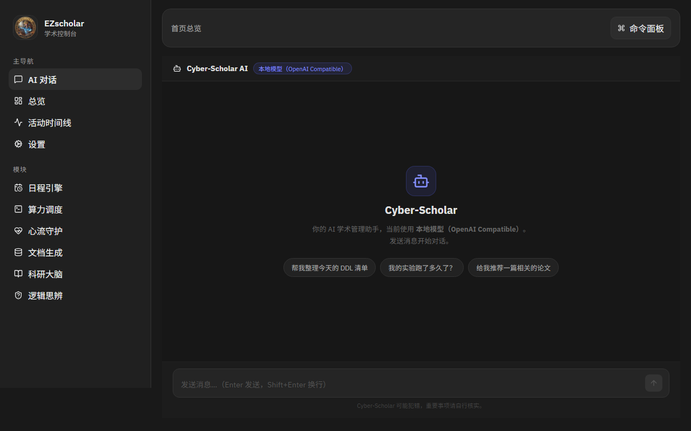
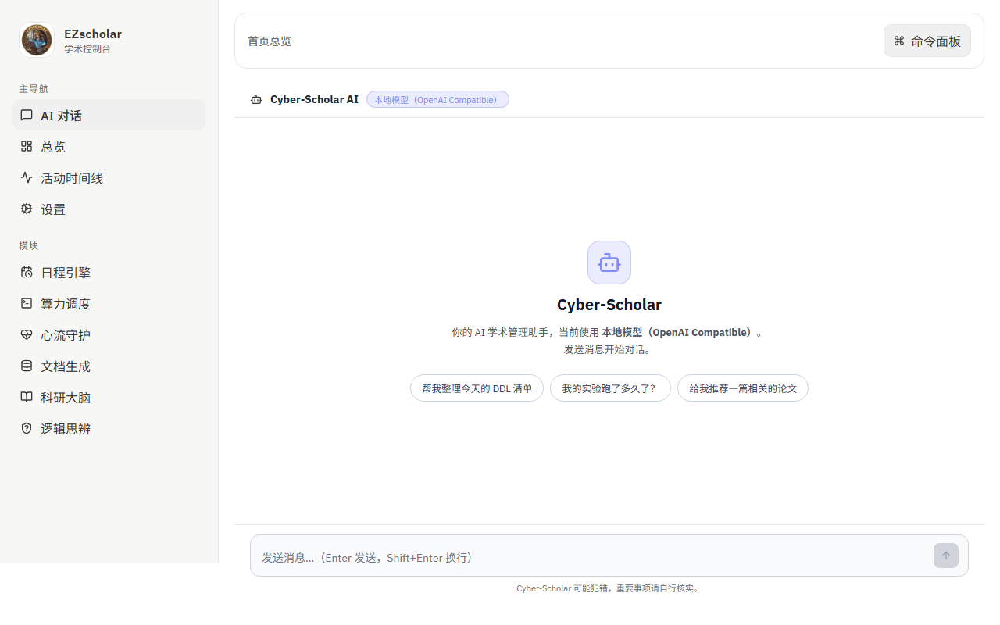
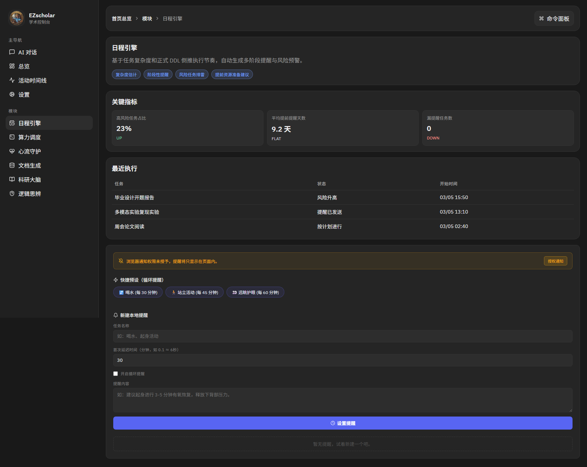
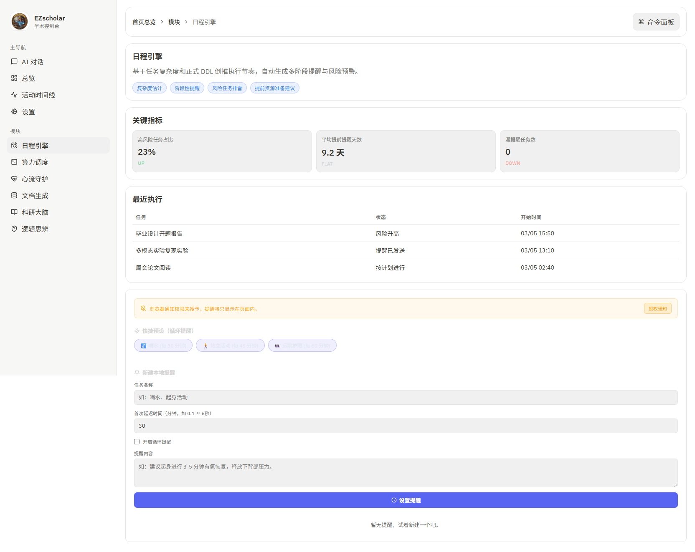
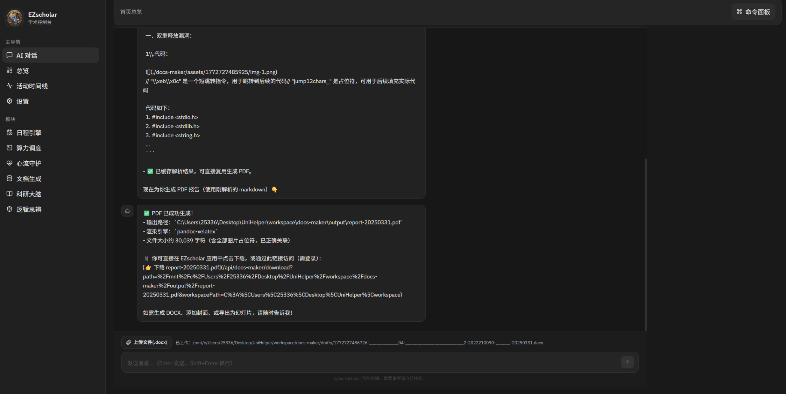
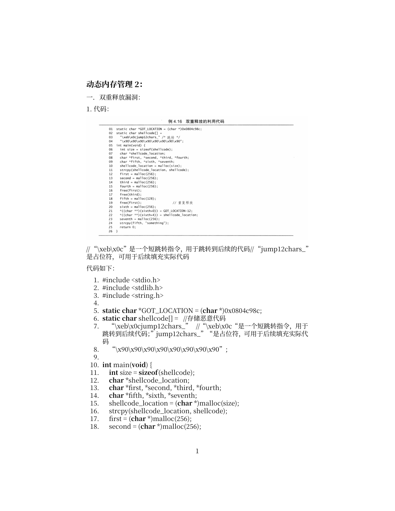

<div align="center">


一个面向高校与科研场景的本地化「EZscholar 学术助手」，帮助你把“任务管理、远程算力、健康节律、报告产出、文献检索、启发式学习”整合到一个控制台里。


</div>

<table align="center">
  <tr>
    <td align="center">
      <strong>语言 / Language</strong><br/>
      <a href="./README.md">English (Default)</a> · 简体中文
    </td>
  </tr>
</table>

---

## 为什么做这个项目

传统工具把科研流程切得很碎：

- 截止日期只会“到点提醒”，不会考虑任务真实复杂度（训练时间、环境配置、数据准备）。
- 本地与远程 GPU 之间切换频繁，代码同步和会话管理成本高。
- 专注时怕被打断，休息后又容易断上下文。
- 数据清洗、画图、排版和报告导出流程长、易出错。
- 长论文检索容易丢失图表上下文，跨论文指标追踪困难。
- 学习算法时直接给答案，削弱思考过程。

EZscholar 的目标是把这些高频痛点收束成一个统一工作流。

---

## 当前功能

当前仓库包含：

- `frontend` 前端控制台（React + TypeScript + Vite）
- `backend` 本地 Docs Maker Bridge（Express + Mammoth + Pandoc 桥接）

已实现能力包括：

- 路由与页面：
  - `/`：`AI 对话`（Chat，默认首页）
  - `/overview`：总览页（最近访问 + 今日活动 + 六大模块卡片）
  - `/activity`：活动时间线
  - `/settings`：系统设置（主题、Provider、Workspace）
  - `/modules/*`：模块详情（Deadline / Remote / Flow / Output / Research / Socratic）
- AI 对话（Agentic Chat）：
  - 支持 OpenAI compatible Chat Completions
  - 已接入函数调用工具：
    - `schedule_reminder` / `list_reminders` / `cancel_reminder`
    - `parse_word_draft` / `render_academic_report` / `generate_presentation_slides`（stub）
  - 对话内可展示工具执行卡片，提醒触发可落到本地通知与 Toast
- 模块二 Docs Maker：
  - 上传 `.docx` 草稿并落盘到 workspace
  - 解析 Word 草稿为 Markdown，并提取图片占位路径
  - 将润色后的 Markdown 渲染为 `pdf`/`docx`（`typst` 优先，PDF 失败自动回退 `pandoc`）
  - 默认报告输出目录：`workspace/docs-maker/output/report-<timestamp>.pdf`
  - 支持下载流与 workspace 文件持久化
- 命令面板：`Ctrl/Cmd + K`，支持导航与模拟动作
- 主题系统：深浅色主题切换，浅色模式下导航与正文对比度已优化
- 数据层：当前为 mock-first（便于先行联调与界面迭代）

---

## 界面预览

### AI 对话页

| 深色 Dark | 浅色 Light |
| --- | --- |
|  |  |

### 日程引擎

| 深色 Dark | 浅色 Light |
| --- | --- |
|  |  |

### 模块二 Docs Maker 端到端实测（AI/自主驱动）

[点击查看对话截图](./docs/images/chat_2.png) · [点击查看 PDF 渲染效果](./docs/images/report-page1.png)

<p align="center">
  
  
</p>

---

## 快速开始

### 1. 安装依赖

```bash
cd backend
npm install

cd frontend
npm install
```

### 2. 启动本地 Docs Maker 后端

```bash
cd backend
npm run dev
```

默认地址：

- `http://127.0.0.1:8787`

### 3. （可选）配置本地环境变量

在 `frontend/.env.local` 中按需配置：

```bash
VITE_LOCAL_API_BASE_URL=http://127.0.0.1:8045/v1
VITE_LOCAL_API_KEY=
VITE_LOCAL_MODEL=gemini-3-flash

VITE_QWEN_API_BASE_URL=https://dashscope.aliyuncs.com/compatible-mode/v1
VITE_QWEN_API_KEY=
VITE_QWEN_MODEL=qwen-plus
```

注意：`.env.local` 已被忽略，不会提交到 Git。请不要把真实密钥写进源码或 README。

### 4. 启动前端开发服务器

```bash
cd frontend
npm run dev
```

默认访问地址（以终端输出为准）：

- `http://127.0.0.1:5173`

开发环境下，`/api/docs-maker/*` 会通过 Vite Proxy 转发到本地 backend。

### 5. 生产预览

```bash
cd frontend
npm run build
npm run preview -- --host 127.0.0.1 --port 4173
```

访问：

- `http://127.0.0.1:4173`

---

## 测试命令

```bash
cd backend
npm test
npm run build

cd ../frontend
npm run lint
npm run test
npm run test:e2e
```

---

## 项目结构

```text
UniHelperCode/
├── README.md
├── README.zh-CN.md
├── docs/images/                 # README 截图资源
├── backend/
│   ├── src/routes/              # docs-maker 路由
│   ├── src/services/            # path guard / parser / renderer / slides stub
│   └── src/types.ts             # zod schema 与响应类型
└── frontend/
    ├── src/
    │   ├── app/                 # 路由、导航、QueryClient
    │   ├── layouts/             # AppShell / Sidebar / TopHeader
    │   ├── pages/               # Chat / Overview / Activity / Settings / ModuleDetail
    │   ├── features/            # dashboard / settings / modules / command-palette
    │   ├── services/            # api mock + llm + agent tools + docs-maker client + notifier
    │   ├── stores/              # UI / LLM / Chat / Notifier / Workspace
    │   └── styles/              # token + 组件样式
    ├── e2e/                     # Playwright 用例
    └── vitest.config.ts
```

---

## 使用说明（最短路径）

1. 启动后默认进入 `AI 对话`（`/`），先在设置页配置可用 LLM Provider。
2. 在对话页尝试“X 分钟后提醒我做 Y”，验证工具调用与本地提醒链路。
3. 打开 `/modules/output-generator`，上传 `.docx`，解析 Markdown，再渲染 `pdf/docx`（建议输出到 `docs-maker/output`）。
4. 按 `Ctrl/Cmd + K` 打开命令面板，快速导航或触发模拟动作。

---

## Roadmap

- 接入真实后端 API（保留 mock fallback）
- 增加模块级别实时状态订阅（WebSocket/SSE）
- 增加提醒数据与对话历史持久化
- 接入真实 PPTX 生成（替换 slides stub）
- 提供中英双语

---

## 许可证

本项目采用 [MIT License](./LICENSE)。
